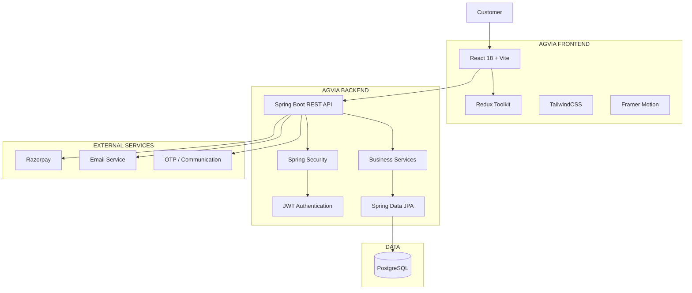

<div align="center">

<a href="#">
  
</a>

<br/>

<h1>AGVIA</h1>

<h3>WOMEN'S WEAR BOUTIQUE</h3>

<p>
  <em>Where tradition meets modern elegance.</em>
</p>

<br/>

<p>
  <strong>Premium Fashion Commerce</strong>
  &nbsp;•&nbsp;
  <strong>Secure Payments</strong>
  &nbsp;•&nbsp;
  <strong>Modern Operations</strong>
</p>

</div>

[](https://react.dev/)
[](https://www.java.com/)
[](https://spring.io/projects/spring-boot)
[](https://www.postgresql.org/)
[](https://razorpay.com/)
[](https://www.docker.com/)

<br/>

### ✦ Premium Fashion Commerce · Secure Payments · Modern Operations

<p>
  <a href="#-experience">Experience</a> •
  <a href="#-features">Features</a> •
  <a href="#-architecture">Architecture</a> •
  <a href="#-tech-stack">Tech Stack</a> •
  <a href="#-api">API</a> •
  <a href="#-security">Security</a> •
  <a href="#-setup">Setup</a> •
  <a href="#-deployment">Deployment</a>
</p>

</div>

---

## ✦ About AGVIA

**AGVIA** is a premium women's fashion e-commerce platform designed around
Indian ethnic wear, contemporary fashion and occasion-based collections.

The platform combines:

- Elegant fashion discovery
- Product collections
- Secure authentication
- Wishlist and cart
- Razorpay payments
- Cash on Delivery
- Order management
- Inventory operations
- Coupon management
- Customer accounts
- Administrative operations
- Responsive mobile-first experience

> **AGVIA is designed as a commerce product — not simply a website.**

---

# ✦ Experience

<div align="center">

| Discover | Shop | Pay | Track |
|:---:|:---:|:---:|:---:|
| ✦ Collections | 🛍️ Products | 🔐 Secure Checkout | 📦 Orders |
| Curated fashion | Product discovery | Razorpay + COD | Lifecycle tracking |

</div>

<br/>

### The customer journey

```text
                 ┌─────────────────────┐
                 │       AGVIA         │
                 │  Women's Boutique   │
                 └──────────┬──────────┘
                            │
                            ▼
                 ┌─────────────────────┐
                 │ Explore Collections │
                 └──────────┬──────────┘
                            │
                            ▼
                 ┌─────────────────────┐
                 │ Discover Products   │
                 └──────────┬──────────┘
                            │
                            ▼
                 ┌─────────────────────┐
                 │   Product Details   │
                 └──────────┬──────────┘
                            │
                            ▼
                 ┌─────────────────────┐
                 │     Add to Cart     │
                 └──────────┬──────────┘
                            │
                            ▼
                 ┌─────────────────────┐
                 │      Checkout       │
                 └──────────┬──────────┘
                            │
                 ┌──────────┴──────────┐
                 ▼                     ▼
          ┌─────────────┐       ┌─────────────┐
          │   Razorpay  │       │     COD     │
          │   Payment   │       │   Payment   │
          └──────┬──────┘       └──────┬──────┘
                 │                     │
                 └──────────┬──────────┘
                            ▼
                 ┌─────────────────────┐
                 │   Order Confirmed   │
                 └──────────┬──────────┘
                            │
                            ▼
                 ┌─────────────────────┐
                 │ Track Order Status  │
                 └─────────────────────┘
```

---

# ✦ Features

<details open>
<summary><strong>🛍️ Customer Experience</strong></summary>

<br/>

- Premium fashion storefront
- Responsive product discovery
- Collection-based browsing
- Product details
- Product images
- Category filtering
- Search
- Wishlist
- Cart
- Guest cart support
- User cart synchronization
- Customer accounts
- Order history
- Responsive mobile experience
- Accessible interaction states

</details>

<details>
<summary><strong>🛒 Commerce Engine</strong></summary>

<br/>

- Product catalogue
- Category management
- Inventory management
- Server-side cart validation
- Coupon validation
- Delivery fee calculation
- Order creation
- Order status management
- Stock management
- Customer order history
- COD support
- Razorpay integration

</details>

<details>
<summary><strong>💳 Payments</strong></summary>

<br/>

### Razorpay

```text
Customer
   │
   ▼
Checkout
   │
   ▼
Create Razorpay Order
   │
   ▼
Razorpay Checkout
   │
   ▼
Payment Completed
   │
   ▼
Backend Verification
   │
   ▼
Signature Validation
   │
   ▼
Order Confirmed
```

The backend is responsible for payment verification.

Never trust payment success information supplied only by the frontend.

</details>

<details>
<summary><strong>📦 Order Operations</strong></summary>

<br/>

```text
PENDING
   ↓
CONFIRMED
   ↓
PROCESSING
   ↓
PREPARING
   ↓
SHIPPED
   ↓
OUT_FOR_DELIVERY
   ↓
DELIVERED
```

Pre-dispatch cancellation can restore inventory where applicable.

</details>

<details>
<summary><strong>👨‍💼 Admin Operations</strong></summary>

<br/>

The administration layer provides operational control for:

- Products
- Categories
- Inventory
- Orders
- Customers
- Coupons
- Order status
- Product availability
- Business metrics
- Customer order history

Backend authorization remains authoritative.

</details>

---

# ✦ Product Collections

<div align="center">

### Curated for every occasion

| Collection | Purpose |
|---|---|
| ✦ Sarees | Traditional & contemporary sarees |
| ✦ Lehengas | Bridal & festive wear |
| ✦ Anarkalis & Kurtas | Elegant ethnic everyday wear |
| ✦ Dresses & Gowns | Contemporary occasion wear |
| ✦ Western Wear | Modern everyday fashion |
| ✦ Kurtis | Comfortable Indian wear |
| ✦ Dupattas | Festive & bridal styling |

</div>

---

# ✦ Architecture



---

# ✦ System Design

```text
┌──────────────────────────────────────────────────────────────┐
│                         AGVIA                                │
│                  Customer Experience                         │
└──────────────────────────────┬───────────────────────────────┘
                               │
                               ▼
┌──────────────────────────────────────────────────────────────┐
│                     React / Vite                             │
│       Components • Pages • Redux • API Services              │
└──────────────────────────────┬───────────────────────────────┘
                               │ HTTPS
                               ▼
┌──────────────────────────────────────────────────────────────┐
│                   Spring Boot REST API                       │
│                                                              │
│ Auth │ Products │ Cart │ Orders │ Payments │ Admin           │
└─────────────┬────────────────┬─────────────────┬─────────────┘
              │                │                 │
              ▼                ▼                 ▼
        ┌──────────┐    ┌────────────┐    ┌────────────┐
        │PostgreSQL│    │  Razorpay  │    │ Messaging  │
        │ Database │    │  Payments  │    │  Services  │
        └──────────┘    └────────────┘    └────────────┘
```

---

# ✦ Tech Stack

<div align="center">

| Layer | Technology |
|---|---|
| Frontend | React 18 |
| Build | Vite |
| Styling | TailwindCSS |
| State | Redux Toolkit |
| Animation | Framer Motion |
| Icons | Lucide React |
| HTTP | Axios |
| Backend | Java 21 |
| Framework | Spring Boot 3.5.3 |
| Security | Spring Security 6 |
| Authentication | JWT / JJWT |
| Password Hashing | BCrypt |
| Persistence | Spring Data JPA |
| ORM | Hibernate |
| Database | PostgreSQL |
| API Docs | SpringDoc OpenAPI / Swagger |
| Payments | Razorpay |
| Web Server | Nginx |
| Containers | Docker / Docker Compose |
| CI/CD | GitHub Actions |

</div>

---

# ✦ Repository Structure

```text
AGVIA/
│
├── .github/
│   └── workflows/
│       └── ci.yml
│
├── docs/
│   └── assets/
│       └── agvia-logo.png
│
├── docker-compose.yml
├── .env.example
├── README.md
│
├── agvia-backend/
│   ├── Dockerfile
│   ├── pom.xml
│   │
│   └── src/
│       └── main/
│           ├── java/
│           │   └── ...
│           │
│           └── resources/
│               ├── application.properties
│               └── application-prod.properties
│
└── agvia-frontend/
    ├── Dockerfile
    ├── nginx.conf
    ├── package.json
    ├── index.html
    │
    └── src/
        ├── App.jsx
        ├── main.jsx
        ├── components/
        ├── hooks/
        ├── pages/
        ├── services/
        └── store/
```

---

# ✦ API

<details>
<summary><strong>🔐 Authentication</strong></summary>

```http
POST /api/auth/register
POST /api/auth/login
GET  /api/auth/me
```

</details>

<details>
<summary><strong>🛍️ Products</strong></summary>

```http
GET /api/products
GET /api/products/{id}
GET /api/products/featured
GET /api/categories
```

</details>

<details>
<summary><strong>🛒 Cart</strong></summary>

```http
GET    /api/cart
POST   /api/cart/items
DELETE /api/cart
```

</details>

<details>
<summary><strong>📦 Orders</strong></summary>

```http
POST /api/orders/checkout
GET  /api/orders
GET  /api/orders/{id}
```

</details>

<details>
<summary><strong>💳 Payments</strong></summary>

```http
POST /api/payments/create-order
POST /api/payments/verify
POST /api/payments/webhook
```

</details>

<details>
<summary><strong>🩺 Health</strong></summary>

```http
GET /api/health
GET /actuator/health
```

</details>

<details>
<summary><strong>👨‍💼 Admin</strong></summary>

```http
GET   /api/admin/orders
PATCH /api/admin/orders/{id}/status

GET   /api/admin/users

GET   /api/admin/products
POST  /api/admin/products
PUT   /api/admin/products/{id}

GET   /api/admin/coupons
POST  /api/admin/coupons
PATCH /api/admin/coupons/{id}/toggle
```

</details>

---

# ✦ Security

AGVIA follows a defense-in-depth security model.

<div align="center">

| Security Layer | Implementation |
|---|---|
| Authentication | JWT |
| Authorization | Role-based access |
| Passwords | BCrypt |
| Session Model | Stateless |
| Token Expiry | Configurable |
| Rate Limiting | Authentication endpoints |
| Transport | HTTPS in deployment |
| Headers | Security headers |
| Errors | Centralized exception handling |
| Observability | Correlation IDs |
| Health | Health/readiness endpoints |
| Payment | Server-side verification |

</div>

### Security principles

```text
NEVER
├── Commit secrets
├── Store passwords in frontend storage
├── Trust frontend payment status
├── Expose backend credentials
├── Return stack traces to customers
└── Authorize admin actions only in the frontend

ALWAYS
├── Validate input
├── Authorize on the backend
├── Hash passwords
├── Verify payment signatures
├── Protect secrets with environment variables
├── Log security-relevant events
└── Return safe user-facing errors
```

---

# ✦ Responsive by Design

AGVIA is designed for real-world screens rather than a single
desktop resolution.

```text
320 ─── 360 ─── 375 ─── 390 ─── 414 ─── 430 ─── 480
                         │
                         ▼
600 ─── 768 ─── 820 ─── 834 ─── 1024
                         │
                         ▼
1280 ─── 1366 ─── 1440 ─── 1536 ─── 1920 ─── 2560
```

### Responsive priorities

- Mobile-first layouts
- Fluid typography
- Adaptive product grids
- Touch-friendly controls
- Horizontal collection rails
- Responsive checkout
- Responsive admin dashboard
- No intentional horizontal overflow
- Accessible touch targets
- Reduced-motion support

---

# ✦ Local Setup

## Requirements

```text
Java 21
Node.js
npm
PostgreSQL
Git
```

---

## 1. Clone

```bash
git clone https://github.com/YOUR_USERNAME/YOUR_REPOSITORY.git

cd YOUR_REPOSITORY
```

---

## 2. Backend

```bash
cd agvia-backend
```

Configure your environment variables.

Example:

```env
DB_URL=jdbc:postgresql://localhost:5432/agvia
DB_USERNAME=postgres
DB_PASSWORD=your-password

JWT_SECRET=your-long-random-secret

RAZORPAY_KEY_ID=your-key
RAZORPAY_KEY_SECRET=your-secret
```

Start Spring Boot:

```bash
./mvnw spring-boot:run
```

Windows:

```bash
mvnw.cmd spring-boot:run
```

Backend:

```text
http://localhost:8080
```

Swagger:

```text
http://localhost:8080/swagger-ui.html
```

---

# ✦ Frontend

```bash
cd agvia-frontend

npm install

npm run dev
```

Frontend:

```text
http://localhost:5173
```

Production build:

```bash
npm run build
```

Preview:

```bash
npm run preview
```

---

# ✦ Environment Variables

### Frontend

```env
VITE_API_BASE_URL=http://localhost:8080/api
```

### Backend

```env
DB_URL=
DB_USERNAME=
DB_PASSWORD=

JWT_SECRET=

RAZORPAY_KEY_ID=
RAZORPAY_KEY_SECRET=

EMAIL_SERVICE_KEY=
OTP_SERVICE_KEY=
```

> Never commit `.env` files or production credentials.

---

# ✦ Docker

Build and start the complete stack:

```bash
docker compose up -d --build
```

Check services:

```bash
docker compose ps
```

View logs:

```bash
docker compose logs -f
```

Stop:

```bash
docker compose down
```

---

# ✦ CI/CD

GitHub Actions validates the project before changes are merged.

```text
             Git Push
                │
                ▼
        ┌───────────────┐
        │ GitHub Actions│
        └───────┬───────┘
                │
       ┌────────┴────────┐
       ▼                 ▼
 Backend Build      Frontend Build
       │                 │
       ▼                 ▼
 Backend Tests       Production Build
       │                 │
       └────────┬────────┘
                ▼
             PASS ✓
```

Workflow:

```text
.github/workflows/ci.yml
```

---

# ✦ Quality Gate

Before merging:

```text
[ ] Backend build passes
[ ] Backend tests pass
[ ] Frontend build passes
[ ] Authentication tested
[ ] Authorization tested
[ ] Cart isolation tested
[ ] Checkout tested
[ ] Payment verification tested
[ ] COD tested
[ ] Order lifecycle tested
[ ] Inventory tested
[ ] Admin APIs tested
[ ] Mobile UI tested
[ ] Responsive layouts tested
[ ] Docker build tested
[ ] Secrets checked
```

---

# ✦ Performance Philosophy

AGVIA follows a simple engineering principle:

```text
MEASURE
   ↓
IDENTIFY BOTTLENECK
   ↓
OPTIMIZE
   ↓
MEASURE AGAIN
```

Areas considered:

- API latency
- Database queries
- N+1 queries
- Connection pooling
- Image loading
- Bundle size
- Rendering performance
- Network requests
- Caching
- Mobile performance
- Core Web Vitals

Performance numbers should be measured from real environments rather
than invented benchmark claims.

---

# ✦ Development Philosophy

### Build for the customer.

Not for the screenshot.

### Build for production.

Not only for localhost.

### Build secure systems.

Not frontend-only security.

### Build responsive interfaces.

Not desktop layouts squeezed onto phones.

### Build maintainable architecture.

Not duplicated logic everywhere.

---

# ✦ Design Language

AGVIA's visual direction follows a refined Indian fashion aesthetic.

```text
                    AGVIA
                      │
        ┌─────────────┼─────────────┐
        ▼             ▼             ▼
      WARM          WINE          GOLD
      IVORY        BURGUNDY      CHAMPAGNE
        │             │             │
        └─────────────┼─────────────┘
                      ▼
             EDITORIAL LUXURY
                      │
          ┌───────────┴───────────┐
          ▼                       ▼
      TRADITION                MODERN
          │                       │
          └───────────┬───────────┘
                      ▼
                   AGVIA
```

Design principles:

- Elegant typography
- Restrained animation
- Premium whitespace
- Strong product imagery
- Clear hierarchy
- Mobile-first interaction
- Accessible controls
- No unnecessary visual noise

---

# ✦ Contributing

<details>
<summary><strong>Development workflow</strong></summary>

<br/>

### Create a branch

```bash
git checkout -b feature/your-feature
```

### Make focused changes

Keep commits small and meaningful.

### Validate

```bash
npm run build
```

Run backend tests before opening a pull request.

### Commit

```bash
git commit -m "feat: improve product discovery"
```

### Push

```bash
git push origin feature/your-feature
```

### Pull Request

Include:

- What changed
- Why it changed
- Screenshots for UI changes
- API impact
- Database impact
- Security impact
- Deployment considerations

</details>

---

# ✦ License

The project license should be explicitly selected by the project owner
before publishing the repository publicly.

Do not claim an open-source license unless the project owner has
intentionally selected one.

---

<div align="center">

## ✦ AGVIA

### Women's Wear Boutique

**Elegant styles. Thoughtful technology.**

<br/>

`React` · `Spring Boot` · `PostgreSQL` · `Razorpay` · `Docker`

<br/>

---

<sub>
Built with attention to design, security, performance and customer experience.
</sub>

<br/>

**Wear Your Story.**

</div>
